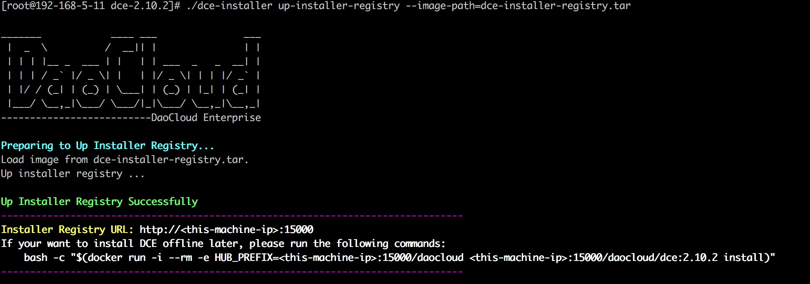

-------------------------------------------------------------------------------
## 部署前 ##
1. 己安装好centos 7.3/7.4操作系统
2. 准备ansible环境  
说明: ansible和离线源需要一台额外的主机, 安装完成后即可回收主机

``` shell
# 安装pip
yum -y install python-setuptools
easy_install pip
# 安装ansible
pip install ansible
```

3. 下载dce_2.10 ansible playbook
``` shell
git clone https://github.com/juneau-work/dce_2.10
cd dce_2.10
```
> 以下操作都以dce_2.10为basedir

4. 配置认证信息
	- i. 复制以下内容生成vault.sh脚本
	``` shell
	cat <<'EOF' > vault.sh
	VAULT_ID='myVAULT@2018'
	echo $VAULT_ID > ~/.vault_pass.txt

	ANSIBLE_USER='root' # ssh用户名
	ANSIBLE_PASSWORD='root' # ssh用户密码
	DCE_USER='admin' # 具有admin权限的dce认证用户
	DCE_PASSWORD='admin' # 具有admin权限的dce认证用户密码

	ansible-vault encrypt_string --vault-id ~/.vault_pass.txt $ANSIBLE_USER --name 'vault_ansible_user' | tee dev/group_vars/vault
	ansible-vault encrypt_string --vault-id ~/.vault_pass.txt $ANSIBLE_PASSWORD --name 'vault_ansible_password' | tee -a dev/group_vars/vault
	ansible-vault encrypt_string --vault-id ~/.vault_pass.txt $DCE_USER --name 'vault_dce_user' | tee -a dev/group_vars/vault
	ansible-vault encrypt_string --vault-id ~/.vault_pass.txt $DCE_PASSWORD --name 'vault_dce_password' | tee -a dev/group_vars/vault
	EOF
	```
	**注意:** 请务必修改脚本中的ssh用户名密码及dce认证用户名密码与实际环境匹配
	- ii. 执行脚本
	``` shell
	bash vault.sh
	```
	**提示**: 后期新增集群节点时，请通过本步骤更新用户认证信息
   
   
   
   
   
-------------------------------------------------------------------------------
## 离线安装(内网拉镜像) ##

#### 1. 搭建离线源 ####
> i. 下载离线安装包**dce-2.10.x.tar**  

[准备离线安装源](http://guide.daocloud.io/dce-v2.10/离线安装控制节点-13871615.html)  

> ii. 上传离线安装包
说明: 作为离线源的主机推荐独立于用于dce节点的主机，当然，如果主机资源紧张，也可以用dce节点中的某台主机作为离线源，这里用192.168.130.1
``` shell
scp dce-2.10.1.tar root@192.168.130.1:/tmp
```

> iii. 启用离线源
``` shell
ssh root@192.168.130.1

export DCE_VERSION=2.10.1 # 修改为要安装的dce版本
export OS_VERSION=7.4.1708 # 修改为与操作系统匹配的版本
tar -xvf /tmp/dce-$DCE_VERSION.tar -C /tmp

cat > /etc/yum.repos.d/dce.repo <<EOF
[dce]
name=dce
baseurl=file:///tmp/dce-$DCE_VERSION/repo/centos-$OS_VERSION
gpgcheck=0
enabled=1
EOF
yum -y --disablerepo=\* --enablerepo=dce install docker-ce
systemctl start docker
rm -rf /etc/yum.repos.d/dce.repo

# 以容器方式运行registry, 默认端口为15000, 既提供dce离线镜像也提供docker, k8s等依赖包
cd /tmp/dce-$DCE_VERSION
./dce-installer up-installer-registry --image-path=dce-installer-registry.tar
```

> iv. 测试离线源可用性

访问http://192.168.130.1:15000, 能成功看到目录索引则离线源配置成功

#### 2. 定义变量 ####
**dev/group_vars/all**    
注意: **离线**安装请一定正确配置变量**dce_offline_repo, dce_hub_prefix**。下面是需要修改的主要变量,其它变量请安需修改
``` yaml
# 组成thinpool的磁盘列表,多块磁盘用','分隔,如/dev/sdb,/dev/sdc
thinpool_disks: /dev/sdb 
# dce版本
dce_version: 2.10.1
# dce离线yum源
dce_offline_repo: http://192.168.130.1:15000/repo/centos-7.4.1708
# dce离线镜像
dce_hub_prefix: 192.168.130.1:15000/daocloud
```

**dev/hosts**  
	- seed是集群的第一台manager节点,用来初始化集群,只能是一个ip地址
	- manager是manager节点组
	- worker是worker节点组
``` ini
[seed]
192.168.130.11

[manager]
192.168.130.12
192.168.130.13

[worker]
192.168.130.14
192.168.130.15
192.168.130.16
192.168.130.17
192.168.130.18
```

#### 3. dce_installer ####
> 对应dce-installer prepare-docker
``` shell
ansible-playbook -i dev/hosts --vault-password-file ~/.vault_pass.txt --extra-vars install_or_uninstall=install dce_installer.yml 
```
#### 4. init cluster ####
> 对应bash -c "$(docker run -i --rm -e HUB_PREFIX=<this-machine-ip>:15000/daocloud <this-machine-ip>:15000/daocloud/dce:2.10.0 install)"
``` shell
ansible-playbook -i dev/hosts --vault-password-file ~/.vault_pass.txt --extra-vars install_or_uninstall=install seed.yml 
```
#### 5. join cluster ####
> 对应sudo bash -c "$(sudo docker run -i --rm -e HUB_PREFIX=<some-machine-ip>:15000/daocloud <some-machine-ip>:15000/daocloud/dce:2.10.0 join --token <Cluster-Token> <some-machine-ip>:2377 80)"
``` shell
ansible-playbook -i dev/hosts --vault-password-file ~/.vault_pass.txt --extra-vars install_or_uninstall=install manager_or_worker.yml 
```
   
   
   
   
   
-------------------------------------------------------------------------------
## 在线安装(公网拉镜像) ##
> 在线安装相比离线安装少了第一步(准备离线源), 其它步骤完全一样  

注意: **在线**安装请一定**注释或删除**变量**dce_offline_repo, dce_hub_prefix**
   
   
   
   
   
-------------------------------------------------------------------------------
## 添加节点到己存在集群 ##
#### 1. 定义变量 ####
**dev/group_vars/all**
请参看上文
#### 2. dce_installer ####
> 此步骤是在待加入集群节点上安装docker, kubelet等依赖包，避免对己存在的集群造成未可知的影响，请务必将主机列表中的seed, manager章节保持为空，只在worker章节指定新worker节点ip  

**dev/hosts**  
``` ini
[seed]

[manager]

[worker]
192.168.130.101
192.168.130.102
192.168.130.103
192.168.130.104
192.168.130.105
192.168.130.106
192.168.130.107
192.168.130.108
192.168.130.109
192.168.130.110
```
> **注意:** 待加入集群的节点如果主机名己经设置好且符合客户要求的命名规范，请一定通过**--skip-tags hostname,hosts**跳过主机名和hosts修改

``` shell
ansible-playbook -i dev/hosts --vault-password-file ~/.vault_pass.txt --extra-vars install_or_uninstall=install dce_installer.yml --skip-tags hostname,hosts
```

#### 3. join cluster ####
> 加入集群需要在seed章节指定任意一台manager节点  

**dev/hosts**  
``` ini
[seed]
192.168.130.11

[manager]

[worker]
192.168.130.101
192.168.130.102
192.168.130.103
192.168.130.104
192.168.130.105
192.168.130.106
192.168.130.107
192.168.130.108
192.168.130.109
192.168.130.110
```
``` shell
ansible-playbook -i dev/hosts --vault-password-file ~/.vault_pass.txt --extra-vars install_or_uninstall=install manager_or_worker.yml 
```
   
   
   
   
   
-------------------------------------------------------------------------------
## 卸载 ##
> **注意:** 卸载需谨慎, 请小心操作。将install置为**uninstall**,如
#### 1. 卸载manager或worker节点 ####
``` shell
ansible-playbook -i dev/hosts --vault-password-file ~/.vault_pass.txt --extra-vars install_or_uninstall=uninstall manager_or_worker.yml 
```
#### 2. 卸载seed节点 ####
``` shell
ansible-playbook -i dev/hosts --vault-password-file ~/.vault_pass.txt --extra-vars install_or_uninstall=uninstall seed.yml 
```
#### 3. 卸载dce依赖包(docker, k8s) ####
``` shell
ansible-playbook -i dev/hosts --vault-password-file ~/.vault_pass.txt --extra-vars install_or_uninstall=uninstall dce_installer.yml 
```
**提示:** 卸载后主机最好重启下，以避免进程或挂载残留
   
   
   
   
   
-------------------------------------------------------------------------------
## 离线升级 ##
#### 1. 搭建离线源 ####
> 使用待升级的离线源版本，离线源配置同上
#### 2. 定义变量 ####
- dev/group_vars/all  
``` yaml
# 升级版本
dce_version: 2.10.2
# 升级离线镜像源
dce_hub_prefix: 192.168.130.1:15000/daocloud
```
- dev/hosts
``` ini
# seed章节指定一台manager ip, 这台manager可以是非leader节点。
[seed]
192.168.130.13

[manager]
192.168.130.11
192.168.130.12

[worker]
192.168.130.14
192.168.130.15
192.168.130.16
192.168.130.17
192.168.130.18
```
#### 3. pull dce镜像 ####
> 所有manager, worker节点都需要提前从离线源拉取待更新的dce镜像
``` shell
ansible-playbook -i dev/hosts --vault-password-file ~/.vault_pass.txt sync_image.yml
```
#### 4. 升级 ####
> **注意:** 此步骤只对seed章节的那台manager生效
> **提示:** 升级只需在manager节点中的任意一台上操作即可，其它manager节点和worker节点会自动升级到对应版本
``` shell
ansible-playbook -i dev/hosts --vault-password-file ~/.vault_pass.txt upgrade.yml
```
   
   
   
   
   
-------------------------------------------------------------------------------
## 在线升级 ##
> **注意:** 请一定注释或删除变量dce_offline_repo, dce_hub_prefix
#### 1. 定义变量 ####
- dev/group_vars/all  
``` yaml
# 升级版本
dce_version: 2.10.2
```
- dev/hosts
``` ini
# seed章节指定一台manager ip, 这台manager可以是非leader节点。
[seed]
192.168.130.13

[manager]
192.168.130.11
192.168.130.12

[worker]
192.168.130.14
192.168.130.15
192.168.130.16
192.168.130.17
192.168.130.18
```
#### 2. 升级 ####
> **注意:** 此步骤只对seed章节的那台manager生效
> **提示:** 升级只需在manager节点中的任意一台上操作即可，其它manager节点和worker节点会自动升级到对应版本
``` shell
ansible-playbook -i dev/hosts --vault-password-file ~/.vault_pass.txt upgrade.yml
```
   
   
   
   
   
